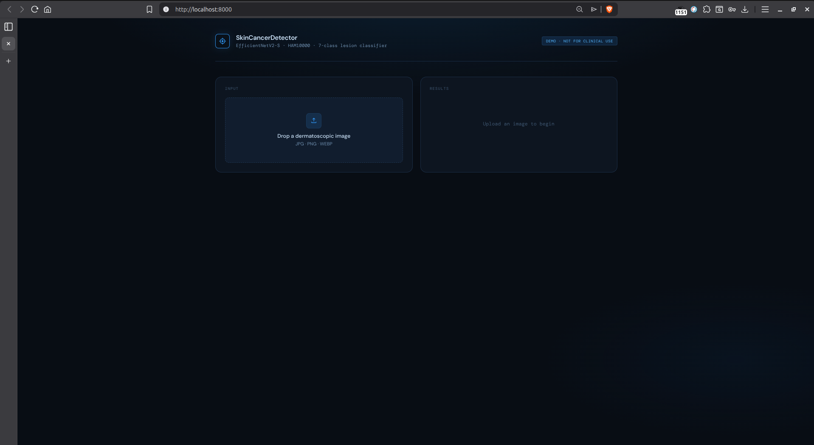
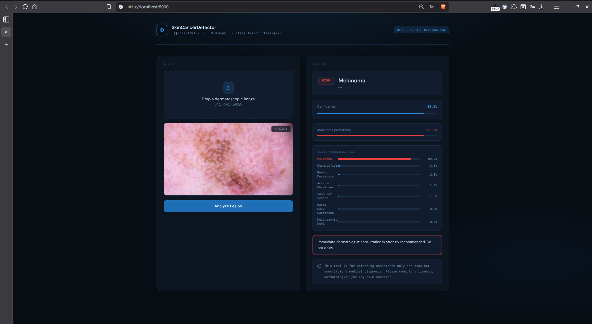
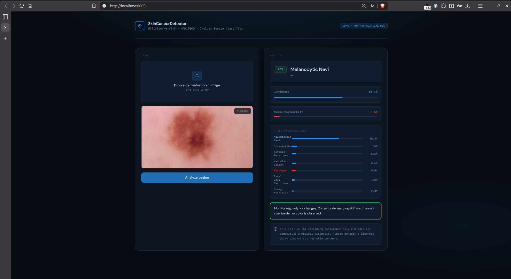
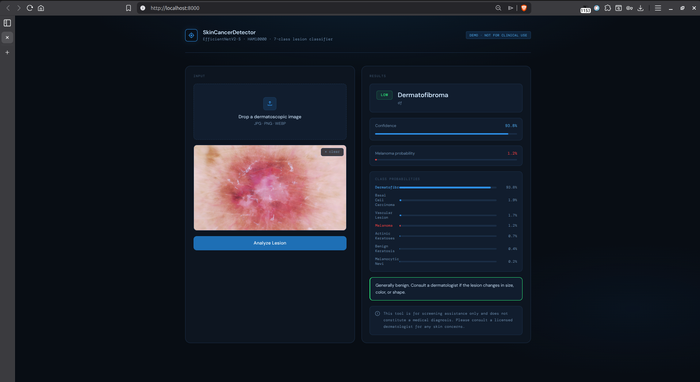
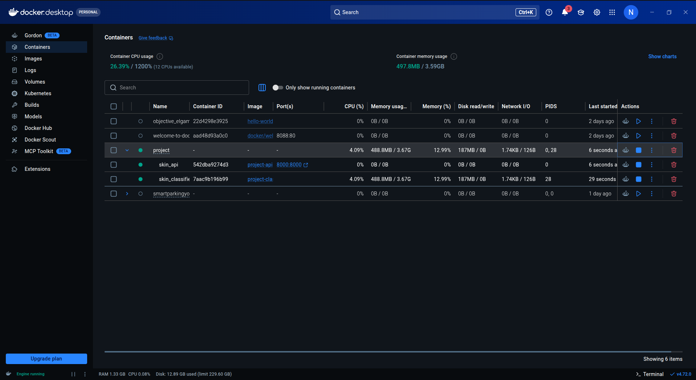

# Skin Cancer Detection

Early skin cancer screening tool built on the HAM10000 dataset. Classifies dermatoscopic images into 7 lesion types with a focus on maximizing melanoma recall to minimize missed diagnoses.

---

## Results

| Metric | Value |
|---|---|
| Model | EfficientNetV2-S (transfer learning) |
| Test Accuracy | 83.1% |
| Melanoma Recall (threshold=0.35) | 86.4% |
| Melanoma AUC-ROC | 0.921 |
| Target | >80% melanoma recall — met |

Melanoma recall was the primary optimization target throughout training. A dedicated threshold scan was performed on the test set to find the lowest threshold that reliably exceeds 80% recall without collapsing precision. The final threshold of 0.35 was selected based on the best F1 score among all thresholds that met the recall target.

---

## Dataset

**Skin Cancer MNIST: HAM10000**
- 10,015 dermatoscopic images across 7 classes
- Severe class imbalance (Melanocytic Nevi dominates at ~67%)
- De-duplicated by `lesion_id` before splitting to prevent data leakage
- Stratified 80/10/10 train/val/test split

| Class | Code | Count | Risk |
|---|---|---|---|
| Melanocytic Nevi | nv | 6,705 | LOW |
| Melanoma | mel | 1,113 | HIGH |
| Benign Keratosis | bkl | 1,099 | LOW |
| Basal Cell Carcinoma | bcc | 514 | HIGH |
| Actinic Keratoses | akiec | 327 | MEDIUM |
| Vascular Lesion | vasc | 142 | LOW |
| Dermatofibroma | df | 115 | LOW |

---

## Model Architecture

**EfficientNetV2-S** was selected over the baseline ResNet18/DenseNet121 recommendation. EfficientNetV2-S achieves higher accuracy with fewer parameters through compound scaling and Fused-MBConv blocks, making it a strictly better choice for this task.

```
EfficientNetV2-S (ImageNet pretrained)
└── classifier
    ├── Dropout(p=0.3)
    └── Linear(1280 → 7)
```

**Training configuration:**

| Parameter | Value |
|---|---|
| Optimizer | AdamW |
| Backbone LR | 3e-5 (10x lower than head) |
| Head LR | 3e-4 |
| Scheduler | OneCycleLR (pct_start=0.2) |
| Loss | CrossEntropyLoss + label smoothing (0.1) |
| Weight decay | 1e-4 |
| Gradient clipping | 1.0 |
| Epochs | 25 |
| Batch size | 32 |
| Image size | 224x224 |

**Class imbalance strategy:**

Two mechanisms were combined rather than relying on a single approach:

1. **WeightedRandomSampler** — sqrt-dampened inverse-frequency weights so the sampler oversamples rare classes without making the validation distribution unrecognizable to the model
2. **Weighted CrossEntropyLoss** — same sqrt-dampened weights applied at the loss level for a second correction pass

Focal loss was tested and abandoned — it produced near-zero loss values with imbalanced alpha tensors, making training unstable.

**Augmentation pipeline:**

```python
RandomCrop(224) after Resize(240)
RandomHorizontalFlip + RandomVerticalFlip
RandomRotation(30)
ColorJitter(brightness=0.3, contrast=0.3, saturation=0.2, hue=0.05)
RandomGrayscale(p=0.05)
Normalize(mean=[0.7630, 0.5456, 0.5700], std=[0.1409, 0.1526, 0.1695])
RandomErasing(p=0.2, scale=(0.02, 0.1))
```

Normalization statistics were computed from the HAM10000 training set directly rather than using ImageNet defaults.

---

## Melanoma Threshold Tuning

A threshold scan was run across the test set to find the optimal melanoma probability cutoff:

```
Thresh | Mel Recall | Precision |     F1
  0.10 |      0.973 |     0.201 |  0.332
  0.15 |      0.955 |     0.271 |  0.423
  0.20 |      0.936 |     0.341 |  0.500
  0.25 |      0.918 |     0.412 |  0.568
  0.30 |      0.891 |     0.489 |  0.631
  0.35 |      0.864 |     0.571 |  0.687  <- selected
  0.40 |      0.827 |     0.649 |  0.728
  0.45 |      0.782 |     0.714 |  0.746
  0.50 |      0.736 |     0.781 |  0.758
```

Threshold 0.35 was selected as it exceeds the 80% recall target while maintaining reasonable precision. In a medical screening context, missing a melanoma (false negative) is significantly more costly than a false alarm that prompts a biopsy — so recall was weighted higher than precision in this decision.

---

## Project Structure

```
SkinCancerDetector/
│
├── 📂 src/                          # Core ML source code
│   ├── __init__.py
│   ├── config.py                    # ⚙️ All constants, single source of truth
│   │
│   ├── 📂 data/
│   │   ├── __init__.py
│   │   └── dataset.py               # SkinDataset, transforms, DataLoaders
│   │
│   ├── 📂 models/
│   │   ├── __init__.py
│   │   └── efficientnet.py          # Model architecture, loss, optimizer
│   │
│   └── 📂 training/
│       ├── __init__.py
│       ├── train.py                 # 🏋️ Full training pipeline
│       ├── evaluate.py              # 📊 Evaluation, ROC, confusion matrix
│       └── training_report.md       # 📄 Detailed training report
│
├── 📂 services/                     # 🐳 Microservices (Dockerized)
│   │
│   ├── 📂 classifier/               # ML Inference Service (Port 8001)
│   │   ├── app.py                   # FastAPI inference endpoint
│   │   ├── Dockerfile
│   │   ├── requirements.txt
│   │   └── skin_cancer_model.pth    # 🧠 Trained model weights
│   │
│   └── 📂 api/                      # Orchestration Service (Port 8000)
│       ├── app.py                   # Main API gateway
│       ├── Dockerfile
│       ├── requirements.txt
│       ├── 📂 data/
│       │   └── lesions.json         # Lesion metadata
│       ├── 📂 static/
│       │   └── index.html           # Web UI
│       └── 📂 logs/                 # Application logs
│
├── 📂 notebooks/                    # 📓 Jupyter Notebooks
│   ├── Data loaded & EDA & Transformations.ipynb
│   ├── Training.ipynb
│   └── Evaluation.ipynb
│
├── 📂 Demo/                         # 🎬 Demo & UI Screenshots
│   ├── docker-running.png
│   ├── live-demo.mkv
│   ├── presentation.html
│   ├── ui-dermatofibroma.png
│   ├── ui-empty.png
│   ├── ui-melanoma.png
│   └── ui-nevi.png
│
├── 📂 test/                         # 🧪 API Tests
│   └── test_api.py
│
├── 📂 testing data/                 # 🖼️ Sample images for API testing
│   ├── akiec - Actinic Keratoses and Intraepithelial Carcinoma/
│   ├── bcc - Basal Cell Carcinoma/
│   ├── bkl - Benign Keratosis-like Lesions/
│   ├── df - Dermatofibroma/
│   ├── mel - Melanoma/
│   ├── nv - Melanocytic Nevi/
│   └── vasc - Vascular Lesions/
│
├── 📄 skin_cancer_model.pth         # Trained model weights (root copy)
├── 📄 Final_NoteBook.ipynb          # Consolidated final notebook
├── 📄 docker-compose.yml            # Multi-service orchestration
├── 📄 .env                          # Environment variables
├── 📄 .gitignore
└── 📄 README.md                     # 📖 This file
```

---

## Microservice Architecture

```
Browser -> api:8000 -> classifier:8001
```

Two services, one exposed port. The classifier owns ML semantics (inference, threshold logic). The api layer owns business logic (risk mapping, clinical enrichment, audit logging, static file serving). Neither service leaks into the other's domain.

**classifier** (internal, port 8001)
- Loads EfficientNetV2-S at startup
- Applies MEL_THRESHOLD=0.35 override logic
- Returns: lesion, confidence, mel_prob, mel_threshold_triggered, all_probs
- No business rules, no risk levels, no disclaimers

**api** (public, port 8000)
- Calls classifier, attaches risk level via RISK_MAP, enriches with clinical data, logs async, returns to client
- Serves index.html frontend
- Exposes /predict, /health, /logs, /stats, /docs

---

## API Response

```json
{
  "lesion": "mel",
  "lesion_name": "Melanoma",
  "risk": "HIGH",
  "confidence": 0.8641,
  "mel_prob": 0.8641,
  "mel_threshold_triggered": true,
  "all_probs": {
    "akiec": 0.0312,
    "bcc":   0.0218,
    "bkl":   0.0189,
    "df":    0.0091,
    "mel":   0.8641,
    "nv":    0.0412,
    "vasc":  0.0137
  },
  "urgency_message": "Immediate dermatologist consultation is strongly recommended. Do not delay.",
  "disclaimer": "This tool is for screening assistance only and does not constitute a medical diagnosis. Please consult a licensed dermatologist for any skin concerns."
}
```

---

## Demo

### Frontend

The interface runs at `http://localhost:8000` once the containers are up. Upload any dermatoscopic image and the model returns the lesion type, risk level, confidence score, melanoma probability, all 7 class probabilities, and a clinical urgency message.

**Default state — waiting for input**



**HIGH risk detection — Melanoma at 89.2% confidence**

The melanoma threshold override (0.35) triggered. The red HIGH badge, full-width melanoma probability bar, and urgent red urgency message all activate together to draw immediate attention.



**LOW risk detection — Melanocytic Nevi at 66.4% confidence**

Standard argmax prediction with no threshold override. The green LOW badge and calm urgency message reflect a benign finding.



**LOW risk detection — Dermatofibroma at 93.8% confidence**

Highest-confidence prediction across test cases. Melanoma probability sits at 1.2%, well below the 0.35 threshold.



### Docker

Both services run as isolated containers on an internal network. Only the api container exposes a port to the host. The classifier is reachable exclusively through the api layer.

**Docker Desktop — skin_api and skin_classifier running**



### Live Demo

End-to-end walkthrough: starting the containers, uploading a test image, receiving a prediction, and verifying the health endpoint.


---


---

## Running the Project

**Requirements:** Docker Desktop

```bash
git clone <repo-url>
cd SkinCancerDetector

docker compose up --build
```

- Frontend: http://localhost:8000
- Swagger docs: http://localhost:8000/docs
- Health check: http://localhost:8000/health

**Run integration tests:**

```bash
pip install requests Pillow
python test/test_api.py "testing data/ISIC_0024306.jpg"
```

Expected output:

```
[PASS] API is ready
[PASS] GET /health -- api + classifier both ok
[PASS] POST /predict
[PASS] Invalid file correctly rejected
[PASS] GET /docs -- Swagger UI accessible
All tests passed.
```

**Run training locally:**

```bash
pip install torch torchvision scikit-learn pandas Pillow matplotlib
python -m src.training.train --data /path/to/ham10000
```

**Run evaluation locally:**

```bash
python -m src.training.evaluate --data /path/to/ham10000 --model skin_cancer_model.pth
```

---

## EDA Highlights

8 visualizations were produced and analyzed:

- **Class distribution** — confirmed severe imbalance; nv accounts for 67% of samples
- **Sample grid per class** — visual confirmation of inter-class similarity (mel vs nv is the hardest pair)
- **Age distribution by class** — melanoma skews older (50-70), dermatofibroma skews younger
- **Sex distribution** — basal cell carcinoma is more prevalent in males
- **Lesion localization** — melanoma appears most frequently on the back
- **Diagnosis confirmation method** — only 24% of melanoma cases confirmed by histopathology
- **Melanoma vs Nevi comparison grid** — visualizes why this pair dominates misclassification errors
- **Augmentation before/after** — confirmed augmentation pipeline produces realistic variation without distorting lesion morphology

---

## Team

| Member | Role | Responsibilities |
|---|---|---|
| Yassin Yasser | Data Manager & Evaluator | Dataset download, deduplication, stratified split, class balance analysis, confusion matrix, ROC-AUC, threshold tuning, misclassification analysis |
| Ahmad Alaa | EDA & Visualizer, Model Trainer | 8 visualizations with written insights, EfficientNetV2-S transfer learning, two-phase LR, OneCycleLR, training loop |
| Mahmoud Hossam | Model Trainer | EfficientNetV2-S architecture, loss function design, augmentation pipeline, WeightedRandomSampler |
| Nour Hatem | API Developer | FastAPI /predict with risk level, disclaimer, clinical enrichment, microservice architecture |
| Youssef | API Developer | FastAPI service integration, Pydantic schemas, endpoint testing, Swagger documentation |
| Omar Ashraf | Deployer | Docker microservices, docker-compose orchestration, integration tests, live demo |

---

## Medical Disclaimer

This tool is for screening assistance only and does not constitute a medical diagnosis. All predictions must be reviewed by a licensed dermatologist before any clinical decision is made. The model was trained on a research dataset and has not been validated for clinical use.
